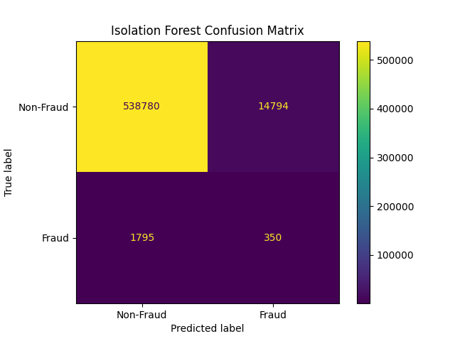
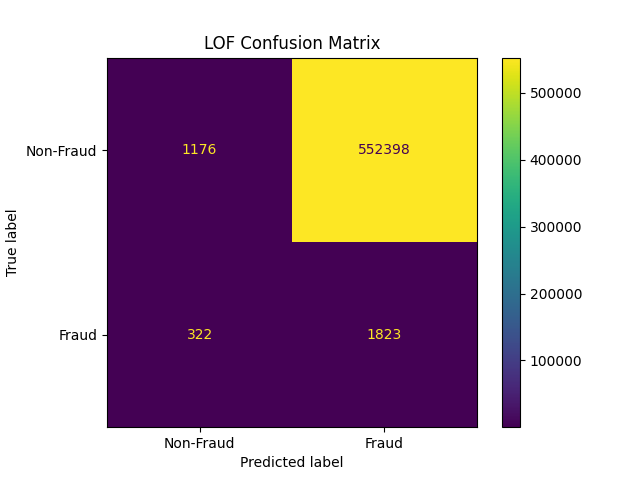
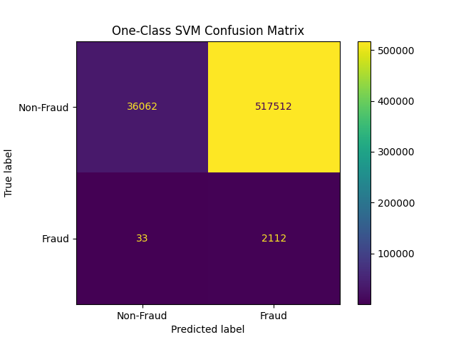
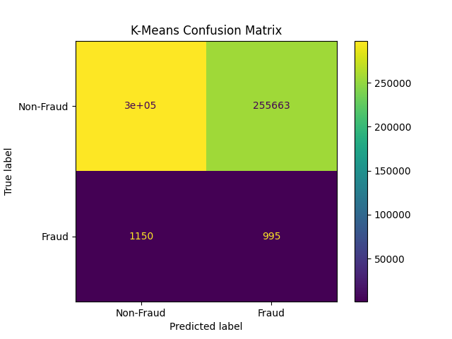
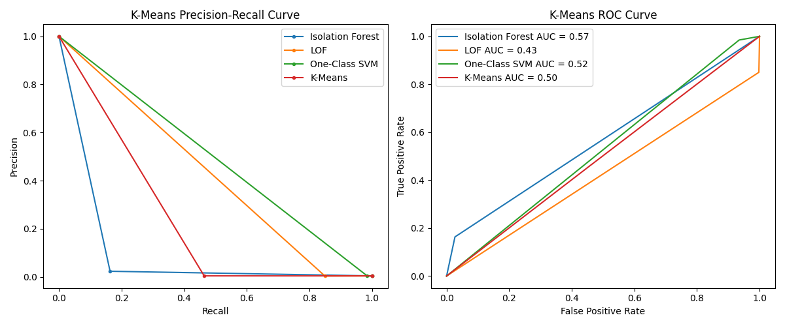

# Anomaly Detection

This is my Masters Project Laboratory 2 project about anomaly detection using machine learning

# Comparison of different types of anomaly detection

## Statistics

Statistics-based approaches work well for simpler well-defined datasets, where assumptions can be made about the data distribution (or the distribution of the data is known)  
Some examples:
- Percentile-based detection/Set static thresholds based on past data, where the model marks exceeding values as anomalies (most basic approach)
- Z-Score: count number of categories that deviate from their mean by a threshold and mark samples which exceed a set number of allowed deviations as anomalies
- Covariance Matrix: build covariance matrix from past data, values that deviate from expected covariance more than an allowed threshold are marked as anomalies
- Grubbs Test: used with normal distributions, where the model marks samples that deviate from the normal distribution more than a threshold as outliers

Advantages:
- Easy to implement
- Works well when data follows a known distribution

Disadvantages:
- Requires assumptions about the data distribution
- Doesn't work well for non-linear/high-dimensional data

Used mostly by financial institutions or healthcare providers

## Machine Learning

Use of machine learning is better for complex, large and variable datasets. The models tune their definition of anomalies based on a provided dataset

### Supervised Learning

Has access to labeled data of normal and anomalous examples  
Some examples:
- K-nearest neighbors
- Linear/Polynomial regression
- Decision trees
- Random Forests
- Support Vector Machines
- Gradient Boosting
- Neural Networks

Advantages:
- Can be used for a wide range of datasets
- Can learn complex relationships between features
- Performs well when provided with large enough labeled data

Disadvantages:
- Requires labeled data, which may be expensive to obtain
- Can struggle with rare anomalies that were not seen during training

Used when labeled data is available, for example transaction fraud detection

### Unsupervised Learning

When there is no access to labeled data, models find their own relations to determine anomalies  
Some examples:
- K means clustering
- DBSCAN (Density-Based Spatial Clustering)
- Isolation forest
- Local Outlier Factor
- Autoencoders (deep learning)

Advantages:
- Doesn't require labeled data
- Can be used for a wide range of datasets
- Can learn complex relationships between features
- Can detect novel anomalies

Disadvantages:
- Usually not as accurate as supervised learning
- Can be harder to train

Used when labeled data is not available, for example network anomaly detection

### Semi-supervised Learning

Some labeled and unlabeled data, acts like supervised learning for labeled data, and tries to approximate for unlabeled data  

Usually less accurate than supervised learning, but can be useful in cases where only a small set of labeled data is available with a lot of unlabeled data and labeling is expensive

### Deep learning

Artificial neural networks with a large number of layers can be useful for identifying anomalies in complex datasets, where other methods could not work well enough  
Some examples:
- Autoencoders
- Generative Adversarial Networks

Advantages:
- Can learn complex/high-dimensional relationships between features
- Can detect novel anomalies
- Can be used for a wide range of datasets that can be very large

Disadvantages:
- Can be harder to train and interpret
- Can be computationally expensive
- Requires a lot of data to train

Used for complex/high-dimensional datasets, for example when working with images

## Time Series based

Time series based approaches focus on patters over time, where anomalies are defined as deviations from the normal patterns, such as spikes or drops in the data  
Some examples:
- Autoregressive Integrated Moving Average (ARIMA)
- Exponential Smoothing (ETS)
- LSTM (Long Short Term Memory) based models

Advantages:
- Effective at detecting seasonal or cyclical patterns

Disadvantages:
- Sensitive to seasonal patterns

Used for time series data, for example power consumption or network traffic

## Graph based

Graph based methods detect anomalies by analyzing the relationships and interactions between entities, often modeled as a graph  
Some examples:
- Graph Convolutional Networks (GCN)
- PageRank
- Random Walks

Advantages:
- Can detect complex relationships between entities
- Can capture both local and global patterns

Disadvantages:
- Can be computationally expensive
- Requires well structured data

Used by social media platforms, for example to detect fake accounts or suspicious behavior

# Progress Report

## 1. Week

### Progress

Looked into and added comparison of different types of anomaly detection techniques  
Found potential datasets, that can be used for the project:
- https://www.kaggle.com/datasets/faizaniftikharjanjua/metaverse-financial-transactions-dataset
- https://www.kaggle.com/datasets/cynthiarempel/amazon-us-customer-reviews-dataset  

Credit card fraud datasets:
- https://www.kaggle.com/datasets/mlg-ulb/creditcardfraud
- https://www.kaggle.com/datasets/kelvinkelue/credit-card-fraud-prediction
- https://data.world/vlad/credit-card-fraud-detection  

Network anomaly detection datasets:
- https://www.kaggle.com/datasets/kaiser14/network-anomaly-dataset?select=network_dataset_labeled.csv
- https://www.kaggle.com/datasets/aymenabb/ddos-evaluation-dataset-cic-ddos2019

### Next week's goals
- Select used dataset
- Find a base architecture for the model
- Test dataset with simpler methods for comparison

## 2. Week

### Progress

Found more credit card fraud datasets, this one has labeled columns:
- https://huggingface.co/datasets/pointe77/credit-card-transaction/tree/main

And this one has a lot of recent data, but no labeled columns:
- https://www.kaggle.com/datasets/nelgiriyewithana/credit-card-fraud-detection-dataset-2023

Added a comparison of the results of 4 different models on the labeled column credit card transaction dataset, I used Isolation Forest, Local Outlier Factor, One-Class SVM and K-Means clustering.

Evaluation Results: in Table format

Isolation Forest:

|              | precision | recall | f1-score | support |
|--------------|-----------|--------|----------|---------|
| 0.0          | 1.00      | 0.97   | 0.98     | 553574  |
| 1.0          | 0.02      | 0.16   | 0.04     | 2145    |
| accuracy     |           |        | 0.97     | 555719  |
| macro avg    | 0.51      | 0.57   | 0.51     | 555719  |
| weighted avg | 0.99      | 0.97   | 0.98     | 555719  |

Local Outlier Factor:

|              | precision | recall | f1-score | support |
|--------------|-----------|--------|----------|---------|
| 0.0          | 0.79      | 0.00   | 0.00     | 553574  |
| 1.0          | 0.00      | 0.85   | 0.01     | 2145    |
| accuracy     |           |        | 0.01     | 555719  |
| macro avg    | 0.39      | 0.43   | 0.01     | 555719  |
| weighted avg | 0.78      | 0.01   | 0.00     | 555719  |

One-Class SVM:

|              | precision | recall | f1-score | support |
|--------------|-----------|--------|----------|---------|
| 0.0          | 1.00      | 0.07   | 0.12     | 553574  |
| 1.0          | 0.00      | 0.98   | 0.01     | 2145    |
| accuracy     |           |        | 0.07     | 555719  |
| macro avg    | 0.50      | 0.52   | 0.07     | 555719  |
| weighted avg | 1.00      | 0.07   | 0.12     | 555719  |

K-Means:  

|              | precision | recall | f1-score | support |
|--------------|-----------|--------|----------|---------|
| 0.0          | 1.00      | 0.54   | 0.70     | 553574  |
| 1.0          | 0.00      | 0.46   | 0.01     | 2145    |
| accuracy     |           |        | 0.54     | 555719  |
| macro avg    | 0.50      | 0.50   | 0.35     | 555719  |
| weighted avg | 0.99      | 0.54   | 0.70     | 555719  |

PR + ROC Curves:

### Next week's goals
- Improve model parameters
- Explain the results
- Add an initial Deep Learning model and compare it with the others
- Maybe try another dataset
- Separate data reading and model training into separate files

## Sources
[comment]: <> (TODO: Add better citations)
- https://medium.com/@reza.shokrzad/6-pivotal-anomaly-detection-methods-from-foundations-to-2023s-best-practices-5f037b530ae6
- https://arxiv.org/abs/1901.03407
- https://www.sciencedirect.com/science/article/abs/pii/S1084804515002891
- https://link.springer.com/article/10.1007/s40747-024-01446-8
